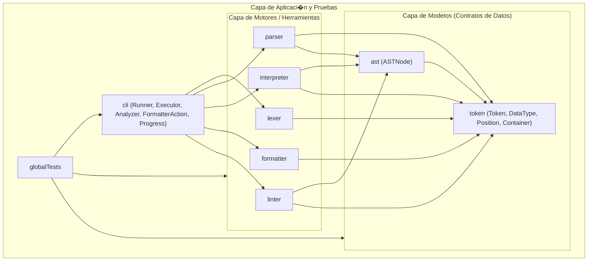

# ??? Arquitectura Modular y Sistema de Plugins - PrintScript-Tools

Este documento detalla la arquitectura modular del proyecto, la justificaci�n de dise�o de cada m�dulo, c�mo se estructuran internamente mediante **packages**, y c�mo extender el sistema mediante **plugins** para procesar lenguajes distintos a PrintScript.

---

## ?? 1. Reestructuraci�n de M�dulos (De 18 Nano-m�dulos a M�dulos Cohesivos)

Se eliminaron los "nano-m�dulos" de un solo archivo y se agruparon por **Common Closure Principle (CCP)** en los m�dulos naturales de un compilador:

| M�dulo | Contenido y M�dulos Absorbidos | Responsabilidad �nica (SRP del M�dulo) |
| :--- | :--- | :--- |
| **`token`** | `Token`, `DataType`, `Position`, `Container`, `RemoveResponse`, `ErrorReporter` (absorbi� `tokendata`, `container`, `error`). | **Modelos y contratos l�xicos:** Estructura at�mica del token, tipos de datos, posiciones espaciales y flujos de tokens. |
| **`ast`** | `ASTNode` | **Modelo sint�ctico:** Definici�n y jerarqu�a del �rbol de Sintaxis Abstracta (`ASTNode`). |
| **`lexer`** | Motor de streaming, `CharSource`, `CharacterClassifier`, `TokenPlugin`, `ExactMatchTokenPlugin`, `RegexTokenPlugin`, `TokenPluginFactory`. | **Motor l�xico:** Transforma secuencias de caracteres en streams de tokens mediante plugins de reconocimiento. |
| **`parser`** | Pratt Parser, `ExpressionParser`, `StatementParser`, `StatementParserFactory`, `PrattToken`, etc. | **Motor sint�ctico:** Transforma secuencias de tokens en un AST validando la gram�tica. |
| **`interpreter`** | Motor de evaluaci�n, `Environment`, `ExecutionContext`, `InputProvider`, `ConsoleInputProvider`, `ActionType` (`Add`, `Print`, `If`, etc.). | **Motor de ejecuci�n sem�ntica:** Eval�a el AST en memoria y gestiona �mbitos/variables e I/O. |
| **`formatter`** | `Formatter`, `FormatRule` (reglas obligatorias y opcionales), `ConfigLoader`. | **Motor de formateo:** Aplica reglas de estilo, espaciado y saltos de l�nea sobre tokens. |
| **`linter`** | `Linter`, `LintRule` (`IdentifierNamingRule`, `PrintLnRule`, etc.), `ConfigLoader`. | **Motor de an�lisis est�tico:** Valida reglas de buenas pr�cticas sobre el AST. |
| **`cli`** | `MainApp` (JLine REPL / Picocli), `Cli`, `Runner`, `Executor`, `Analyzer`, `FormatterAction`, `MultiStepProgress`, `ProgressIndicator`. | **Capa de aplicaci�n y presentaci�n:** Orquesta los comandos de usuario, CLI interactiva y reporta el progreso. |
| **`globalTests`** | Tests de integraci�n End-to-End, TCK y tests agn�sticos. | **Validaci�n integral del sistema.** |

---

## ?? 2. �Por qu� `token` y `ast` est�n separados? (Evitando la "Bolsa de Gatos")

Juntar `token` y `ast` en un �nico m�dulo gen�rico (como `core` o `common`) introduce el riesgo del **anti-patr�n "Junk Drawer" (Caj�n de cachivaches / Bolsa de gatos)**, donde se arroja cualquier clase sin identidad clara. 

Mantener `token` y `ast` como m�dulos independientes aporta 3 beneficios fundamentales:

1. **Identidad de Dominio Clara:**
   * **`token`:** Modela la **representaci�n l�xica lineal y plana** (caracteres, palabras clave, posiciones en el archivo).
   * **`ast`:** Modela la **representaci�n sint�ctica jer�rquica** (�rbol de nodos con relaciones padre-hijo).
2. **El Compilador Previene Acoplamientos Accidentales:**
   * Si estuvieran juntos, un desarrollador podr�a importar `ASTNode` dentro del `lexer` o dentro del `formatter` por error y Gradle lo compilar�a.
   * Al estar separados, `lexer` y `formatter` **f�sicamente no tienen `ast` en su classpath**. El compilador de Kotlin impide romper las capas.
3. **Fases Formales de Compiladores:**
   * Fase L�xica: Texto $\rightarrow$ Tokens (`token`).
   * Fase Sint�ctica: Tokens $\rightarrow$ AST (`ast`).
   * Fase Sem�ntica: AST $\rightarrow$ Ejecuci�n / An�lisis.

---

## ?? 3. �Por qu� dentro de un M�dulo se usan Packages en lugar de crear m�s M�dulos/Carpetas Gradle?

Es fundamental diferenciar los 3 conceptos:

1. **M�dulo Gradle (Unidad de Compilaci�n y Despliegue):**
   * Cada m�dulo tiene su propio `build.gradle`, genera su propio archivo `.jar` y tiene un classpath aislado.
   * Crear un m�dulo Gradle para 1 o 2 archivos genera sobrecarga de configuraci�n, lentitud en Gradle y dependencias cruzadas innecesarias.
2. **Package en Kotlin/Java (Espacio de Nombres L�gico):**
   * Es la herramienta nativa del lenguaje para organizar y categorizar clases dentro de un mismo m�dulo.
   * Permite usar modificadores de visibilidad (`internal` en Kotlin) para que ciertas clases sean accesibles dentro del m�dulo pero invisibles para los m�dulos externos.
3. **Carpetas F�sicas en el Disco:**
   * La estructura `src/main/kotlin/...` es simplemente la convenci�n de carpetas del sistema de archivos donde residen los archivos `.kt`.

> **Regla de Oro:** Se crea un **M�dulo Gradle** cuando hay un l�mite de subsistema/despliegue (ej. `lexer` vs `parser`). Dentro de ese subsistema, se usan **Packages** para organizar las clases l�gicamente sin sobrecargar el build.

---

## ?? 4. �C�mo se Enlazan los M�dulos entre S�?

El grafo de dependencias es **estrictamente unidireccional y ac�clico**:



### Flujo de Ejecuci�n en el Pipeline:
1. **`cli`** recibe el comando del usuario (`execution`, `analyzer`, `formatter`, etc.) y el archivo fuente.
2. **`lexer`** lee los caracteres y, mediante su lista de `TokenPlugin`, produce un `Container` con los `Token`s.
3. **`parser`** recibe los `Token`s y ejecuta sus `StatementParser`s para construir el `ASTNode`.
4. **`interpreter`** recibe el `ASTNode` y despacha cada nodo a su `ActionType` handler correspondiente.
5. **`formatter`** recibe los `Token`s y ejecuta sus `FormatRule`s para producir el c�digo formateado.
6. **`linter`** recibe el `ASTNode` y ejecuta sus `LintRule`s para reportar advertencias o errores de estilo.

---

## ?? 5. L�gica de Plugins en Cada M�dulo

Todos los m�dulos siguen el **Principio Abierto/Cerrado (OCP)** y **Inversi�n de Dependencias (DIP)**:

1. **Lexer (`TokenPlugin`):**
   * Interfaz: `fun match(piece: String, position: Position): Token?`
   * Permite inyectar nuevos plugins regex o palabras clave exactas (`ExactMatchTokenPlugin`, `RegexTokenPlugin`).
2. **Parser (`StatementParser` & `PrattToken`):**
   * Interfaz: `fun canParse(tokens: Container): Boolean` y `fun parse(tokens: Container, parser: ExpressionParser): ASTNode`.
   * Permite agregar nuevas construcciones sint�cticas (ej. bucles `while`, sentencias `match`, etc.) inyectando un nuevo `StatementParser`.
3. **Interpreter (`ActionType`):**
   * Interfaz: `fun interpret(node: ASTNode, interpreter: ExecutionContext): Any`
   * Permite registrar nuevos comportamientos con `interpreter.registerHandler(action, handler)` o `registerFunctionAction(name, action)`.
4. **Formatter (`FormatRule`):**
   * Interfaz: `fun apply(tokens: Container, context: FormatterContext): Container`
   * Permite agregar reglas de espaciado o indentaci�n configurables mediante YAML.
5. **Linter (`LintRule`):**
   * Interfaz: `fun lint(node: ASTNode): List<LintError>`
   * Permite agregar nuevas reglas est�ticas configurables mediante YAML.

---

## ?? 6. �C�mo Probar el Motor con un Lenguaje Distinto a PrintScript?

Dado que los motores reciben abstracciones (`TokenPlugin`, `StatementParser`, `ActionType`), puedes definir un mini-lenguaje completo **sin tocar una sola l�nea del c�digo core**.

Ver el test de integraci�n en `globalTests/src/test/kotlin/LanguageAgnosticPluginTest.kt`:

```kotlin
// 1. Definir plugins l�xicos para el nuevo lenguaje (sintaxis: echo <expr>;)
val customPlugins: List<TokenPlugin> = listOf(
    ExactMatchTokenPlugin(
        mapOf(
            "echo" to DataType.PRINTLN,
            "+" to DataType.ADDITION,
            ";" to DataType.SEMICOLON,
            " " to DataType.SPACE
        )
    ),
    RegexTokenPlugin(Regex("^[0-9]+$"), DataType.NUMBER_LITERAL)
)

// 2. Lexear con el motor agn�stico
val lexer = Lexer.from("echo 5 + 10;", customPlugins)
val statements = lexer.lexIntoStatements().toList()

// 3. Parser para la sentencia 'echo'
val customEchoStatementParser = object : StatementParser {
    override fun canParse(tokens: Container): Boolean = 
        tokens.size() >= 2 && tokens.first()?.type == DataType.PRINTLN

    override fun parse(tokens: Container, parser: ExpressionParser): ASTNode {
        val exprAst = parser.expParse(tokens.slice(1, tokens.size()))
        return ASTNode(DataType.PRINTLN, "echo", Position(1, 1), listOf(exprAst))
    }
}
val parser = Parser(statements.first(), "1.0", listOf(customEchoStatementParser))
val ast = parser.parse()

// 4. Int�rprete con handler personalizado
val outputs = mutableListOf<String>()
val interpreter = Interpreter("1.0", printer = { println(it) })
interpreter.registerHandler(Actions.PRINT, object : ActionType {
    override fun interpret(node: ASTNode, interpreter: ExecutionContext): Any {
        val value = node.children.firstOrNull()?.let { interpreter.interpret(it) }
        interpreter.printer("CUSTOM ECHO: $value")
        return value ?: ""
    }
})

interpreter.interpret(ast)
// Output: CUSTOM ECHO: 15
```
### 1. 🔍 Linter: SÍ, 100%

El módulo linter respeta la lógica de plugins a la perfección:

• El motor es agnóstico: La clase Linter.kt no tiene ninguna regla hardcodeada. Solo recibe una lista inyectada de reglas:
class Linter(private val rules: List<LintRule>) {
fun lint(asts: List<ASTNode>): List<LintError> {
return asts.flatMap { ast -> rules.flatMap { it.apply(ast) } }
}
}

• Cada regla es un plugin: Todas implementan la interfaz común LintRule.kt (IdentifierNamingRule, PrintLnRule, IfWithoutElseRule, ImmutableValRule, etc.).
• Extensibilidad: Si mañana quieres agregar una regla nueva, creas una clase que implemente LintRule, la agregas a la configuración YAML y el motor la ejecuta sin
tocar Linter.kt.
──────
### 2. 🎨 Formatter: SÍ, 100%

El módulo formatter también respeta la lógica de plugins al 100%:

• El motor es una tubería de reglas: La clase Formatter.kt solo itera sobre la lista de reglas cargadas:
for (rule in rules) {
currentStatements = rule.format(currentStatements)
}

• Cada regla es un plugin: Todas implementan FormatRule.kt (IndentationRule, SpaceAroundOperatorRule, AssignSpacingRule, IfBraceOnSameLineRule, etc.).
• Configurable: Se instancian dinámicamente a través del archivo YAML (ConfigLoader).
──────
### 3. 🖥️ CLI: PARCIALMENTE (Patrón Fachada / Dispatcher)

El módulo cli actualmente no usa un sistema dinámico de plugins de comandos, sino un Command Dispatcher con when:

• Cómo está hoy:
En Cli.kt, los comandos están enumerados estáticamente:
when (commandName) {
"formatter" -> runner.formatterCommand(commandArgs)
"analyzer" -> runner.analyzerCommand(commandArgs)
"execution" -> runner.executionCommand(commandArgs)
"validation" -> runner.validationCommand(commandArgs)
else -> println("Unknown command: $commandName")
}

• ¿Cumple buenos principios?: Sí, cumple Single Responsibility (SRP) porque cada comando se delega a su propia clase especializada (Executor.kt, Analyzer.kt,
FormatterAction.kt).
• ¿Cómo sería si fuera 100% plugin (Command Pattern)?:
Tendrías una interfaz de comando:
interface CliCommand {
val name: String
fun execute(args: List<String>)
}
Y el Cli simplemente tendría un mapa Map<String, CliCommand> donde se registran los comandos sin ningún when hardcodeado.
──────