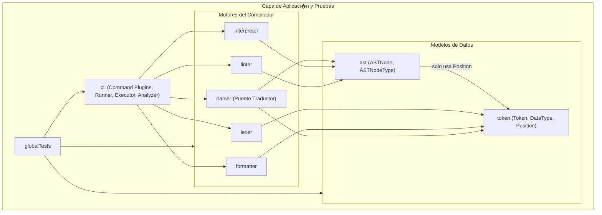

# ??? Arquitectura Modular y Sistema de Plugins - PrintScript-Tools

Este documento detalla la arquitectura modular del proyecto, la justificaci�n de dise�o de cada m�dulo, c�mo se estructuran internamente mediante **packages**, y c�mo extender el sistema mediante **plugins** para procesar lenguajes distintos a PrintScript o agregar nuevos comandos CLI.

---

## ?? 1. Reestructuraci�n de M�dulos (De 18 Nano-m�dulos a M�dulos Cohesivos)

Se eliminaron los "nano-m�dulos" de un solo archivo y se agruparon por **Common Closure Principle (CCP)** en los m�dulos naturales de un compilador:

| M�dulo | Contenido y M�dulos Absorbidos | Responsabilidad �nica (SRP del M�dulo) |
| :--- | :--- | :--- |
| **`token`** | `Token`, `DataType`, `Position`, `Container`, `RemoveResponse`, `ErrorReporter` (absorbi� `tokendata`, `container`, `error`). | **Modelos y contratos l�xicos:** Estructura at�mica del token, tipos de datos, posiciones espaciales y flujos de tokens. |
| **`ast`** | `ASTNode`, `ASTNodeType` | **Modelo sint�ctico puro:** Definici�n de la estructura en �rbol (`ASTNode`) y su clasificaci�n sem�ntica (`ASTNodeType`), desacoplado de los tokens l�xicos. |
| **`lexer`** | Motor de streaming, `CharSource`, `CharacterClassifier`, `TokenPlugin`, `ExactMatchTokenPlugin`, `RegexTokenPlugin`, `TokenPluginFactory`. | **Motor l�xico:** Transforma secuencias de caracteres en streams de tokens mediante plugins de reconocimiento. |
| **`parser`** | Pratt Parser, `ExpressionParser`, `StatementParser`, `StatementParserFactory`, `PrattToken`, etc. | **Motor sint�ctico y traductor:** Transforma secuencias de `Token` (`DataType`) en un AST puro (`ASTNodeType`). |
| **`interpreter`** | Motor de evaluaci�n, `Environment`, `ExecutionContext`, `InputProvider`, `ConsoleInputProvider`, `ActionType` (`Add`, `Print`, `If`, etc.). | **Motor de ejecuci�n sem�ntica:** Eval�a los nodos del AST (`ASTNodeType`) en memoria y gestiona �mbitos/variables e I/O. |
| **`formatter`** | `Formatter`, `FormatRule` (reglas obligatorias y opcionales), `ConfigLoader`. | **Motor de formateo:** Aplica reglas de estilo, espaciado y saltos de l�nea sobre tokens. |
| **`linter`** | `Linter`, `LintRule` (`IdentifierNamingRule`, `PrintLnRule`, etc.), `ConfigLoader`. | **Motor de an�lisis est�tico:** Valida reglas de buenas pr�cticas sobre el AST (`ASTNodeType`). |
| **`cli`** | `MainApp` (JLine REPL / Picocli), `Cli`, `CliCommand` (`ExecutionCommand`, `AnalyzerCommand`, `FormatterCommand`, `ValidationCommand`), `Runner`, `Executor`, `Analyzer`, `FormatterAction`, `MultiStepProgress`, `ProgressIndicator`. | **Capa de aplicaci�n extensible:** Despacha comandos desacoplados mediante el patr�n Command / Plugins y maneja la UI interactiva. |
| **`globalTests`** | Tests de integraci�n End-to-End, TCK y tests agn�sticos. | **Validaci�n integral del sistema.** |

---

## ?? 2. �Por qu� `token` y `ast` est�n separados? (Evitando la "Bolsa de Gatos")

Juntar `token` y `ast` en un �nico m�dulo gen�rico (como `core` o `common`) introduce el riesgo del **anti-patr�n "Junk Drawer" (Caj�n de cachivaches / Bolsa de gatos)**, donde se arroja cualquier clase sin identidad clara. 

Mantener `token` y `ast` como m�dulos independientes aporta 3 beneficios fundamentales:

1. **Identidad de Dominio Clara:**
   * **`token`:** Modela la **representaci�n l�xica lineal y plana** (palabras clave, operadores, caracteres, posiciones en el archivo).
   * **`ast`:** Modela la **representaci�n sint�ctica jer�rquica** (`ASTNodeType` con relaciones padre-hijo).
2. **El Compilador Previene Acoplamientos Accidentales:**
   * Al estar separados, `lexer` y `formatter` **f�sicamente no tienen `ast` en su classpath**. Si un desarrollador intenta importar `ASTNode` dentro del lexer, el compilador de Kotlin arroja error y previene acoplamientos indebidos.
3. **Fases Formales de Compiladores:**
   * Fase L�xica: Texto $\rightarrow$ Tokens (`token`).
   * Fase Sint�ctica: Tokens $\rightarrow$ AST (`ast`).
   * Fase Sem�ntica: AST $\rightarrow$ Ejecuci�n / An�lisis.

---

## ?? 3. Desacoplamiento L�xico vs Sint�ctico (`DataType` vs `ASTNodeType`)

Anteriormente, los nodos del AST reutilizaban el enum `DataType` del m�dulo `token`. Esto obligaba al AST a depender del vocabulario l�xico (signos de puntuaci�n como `;`, `{`, espaciados, etc.).

Para resolver esto:
1. **`ASTNodeType` vive en `ast`:** Describe la sem�ntica pura del nodo (`DECLARATION`, `ASSIGNATION`, `IF_STATEMENT`, `BINARY_OPERATION`, `LITERAL`, etc.).
2. **`Parser` act�a como �nico puente de traducci�n:** Convierte `DataType` l�xico en `ASTNodeType` sint�ctico.
3. **`Interpreter` y `Linter` consumen `ASTNodeType`:** Ya no necesitan importar `DataType` ni saber c�mo se leyeron los tokens originales.

---

## ?? 4. �Por qu� dentro de un M�dulo se usan Packages en lugar de crear m�s M�dulos/Carpetas Gradle?

Es fundamental diferenciar los 3 conceptos:

1. **M�dulo Gradle (Unidad de Compilaci�n y Despliegue):**
   * Cada m�dulo tiene su propio `build.gradle`, genera su propio archivo `.jar` y tiene un classpath aislado.
   * Crear un m�dulo Gradle para 1 o 2 archivos genera sobrecarga de configuraci�n, lentitud en Gradle y dependencias cruzadas innecesarias.
2. **Package en Kotlin/Java (Espacio de Nombres L�gico):**
   * Es la herramienta nativa del lenguaje para organizar y clasificar las clases **dentro del mismo m�dulo**.
   * Permite usar modificadores de visibilidad (`internal` en Kotlin) para que ciertas clases sean accesibles dentro del m�dulo pero invisibles para los m�dulos externos.
3. **Carpetas F�sicas en el Disco:**
   * La estructura `src/main/kotlin/...` es simplemente la convenci�n de carpetas del sistema de archivos donde residen los archivos `.kt`.

---

## ?? 5. Grafo de Dependencias Unidireccional y Ac�clico



---

## ?? 6. L�gica de Plugins en Cada M�dulo (100% Extensible)

Todos los m�dulos siguen el **Principio Abierto/Cerrado (OCP)** y el **Command Pattern**:

1. **CLI (`CliCommand`):**
   * Interfaz: `interface CliCommand { val name: String; val description: String; fun execute(args: List<String>) }`
   * Los comandos ya no usan switches hardcodeados: `Cli` mantiene un registro din�mico (`cli.registerCommand(...)`). Se pueden registrar nuevos comandos en caliente sin modificar `Cli.kt`.
2. **Lexer (`TokenPlugin`):**
   * Interfaz: `fun match(piece: String, position: Position): Token?`
   * Permite inyectar nuevos plugins regex o palabras clave exactas (`ExactMatchTokenPlugin`, `RegexTokenPlugin`).
3. **Parser (`StatementParser` & `PrattToken`):**
   * Interfaz: `fun canParse(tokens: Container): Boolean` y `fun parse(tokens: Container, parser: ExpressionParser): ASTNode`.
   * Permite agregar nuevas construcciones sint�cticas (ej. bucles `while`, `match`, etc.) inyectando un nuevo `StatementParser`.
4. **Interpreter (`ActionType`):**
   * Interfaz: `fun interpret(node: ASTNode, interpreter: ExecutionContext): Any`
   * Permite registrar nuevos comportamientos con `interpreter.registerHandler(action, handler)` o `registerFunctionAction(name, action)`.
5. **Formatter (`FormatRule`):**
   * Interfaz: `fun format(statements: List<Container>): List<Container>`
   * Permite agregar reglas de espaciado o indentaci�n configurables mediante YAML.
6. **Linter (`LintRule`):**
   * Interfaz: `fun lint(node: ASTNode): List<LintError>`
   * Permite agregar nuevas reglas est�ticas configurables mediante YAML.

---

## ?? 7. �C�mo Probar el Motor con un Lenguaje Distinto a PrintScript?

Dado que los motores reciben abstracciones (`TokenPlugin`, `StatementParser`, `ActionType`), puedes definir un mini-lenguaje completo **sin tocar una sola l�nea del c�digo core**.

Ver el test de integraci�n en `globalTests/src/test/kotlin/LanguageAgnosticPluginTest.kt`:

```kotlin
// 1. Definir plugins l�xicos para el nuevo lenguaje (sintaxis: echo <expr>;)
val customPlugins: List<TokenPlugin> = listOf(
    ExactMatchTokenPlugin(
        mapOf(
            "echo" to DataType.PRINTLN,
            "+" to DataType.ADDITION,
            ";" to DataType.SEMICOLON,
            " " to DataType.SPACE
        )
    ),
    RegexTokenPlugin(Regex("^[0-9]+$"), DataType.NUMBER_LITERAL)
)

// 2. Lexear con el motor agn�stico
val lexer = Lexer.from("echo 5 + 10;", customPlugins)
val statements = lexer.lexIntoStatements().toList()

// 3. Parser para la sentencia 'echo' que emite ASTNodeType
val customEchoStatementParser = object : StatementParser {
    override fun canParse(tokens: Container): Boolean = 
        tokens.size() >= 2 && tokens.first()?.type == DataType.PRINTLN

    override fun parse(tokens: Container, parser: ExpressionParser): ASTNode {
        val exprAst = parser.expParse(tokens.slice(1, tokens.size()))
        return ASTNode(ASTNodeType.PRINTLN, "echo", Position(1, 1), listOf(exprAst))
    }
}
val parser = Parser(statements.first(), "1.0", listOf(customEchoStatementParser))
val ast = parser.parse()

// 4. Int�rprete con handler personalizado
val outputs = mutableListOf<String>()
val interpreter = Interpreter("1.0", printer = { println(it) })
interpreter.registerHandler(Actions.PRINT, object : ActionType {
    override fun interpret(node: ASTNode, interpreter: ExecutionContext): Any {
        val value = node.children.firstOrNull()?.let { interpreter.interpret(it) }
        interpreter.printer("CUSTOM ECHO: $value")
        return value ?: ""
    }
})

interpreter.interpret(ast)
// Output: CUSTOM ECHO: 15
```
