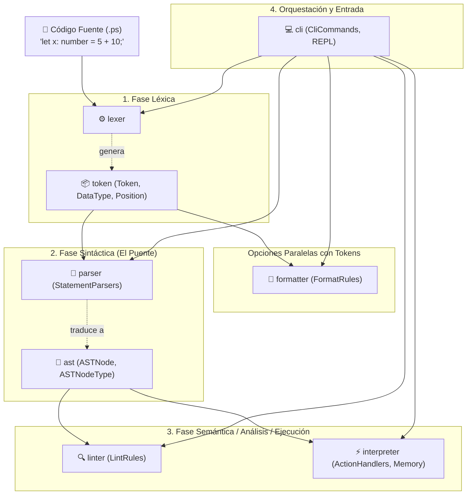

# 🗺️ Sentido de Cada Módulo y Cómo se Enlazan Entre Sí

Este documento explica de forma clara y pedagógica **cuál es la razón de ser de cada módulo** del proyecto **PrintScript-Tools**, por qué existe de forma separada, qué entra y sale de cada uno, **cómo se conectan entre sí** para formar el pipeline completo del compilador/intérprete, y la **historia de la reestructuración (Antes vs Ahora, Pros y Contras)**.

---

## 🧭 Visión General: El Pipeline de PrintScript

El compilador funciona como una línea de ensamblaje (pipeline). Cada módulo tiene un único trabajo bien definido y le pasa el resultado al siguiente:



---

## 🔄 1. Evolución del Proyecto: Antes vs Ahora

### ❌ ¿Cómo eran los módulos antes? (La sobre-fragmentación de 18 módulos)
Originalmente el proyecto estaba fragmentado en **18 módulos Gradle**, muchos de los cuales eran **"Nano-módulos" de un solo archivo**:
* `tokendata` (solo `DataType.kt` y `Position.kt`).
* `container` (solo `Container.kt` y `RemoveResponse.kt`).
* `error` (solo `ErrorReporter.kt`).
* `inputprovider` (solo `InputProvider.kt` y `ConsoleInputProvider.kt`).
* `progress` (solo `ProgressIndicator.kt` y `MultiStepProgress.kt`).
* `analyzer` (solo `Analyzer.kt`).
* `executor` (solo `Executor.kt`).
* `formatteraction` (solo `FormatterAction.kt`).
* `runner` (solo `Runner.kt`).
* `mainApp` (solo `MainApp.kt`).
* Módulos boilerplate vacíos (`app`, `list`, `utilities`).

### ✅ ¿Cómo son ahora? (8 Módulos Cohesivos)
Se unificaron siguiendo el **Common Closure Principle (CCP)** (lo que cambia junto por la misma razón, va en el mismo módulo):

| Módulo Actual | Módulos Anteriores Absorbidos | Responsabilidad Única |
| :--- | :--- | :--- |
| **`token`** | `token`, `tokendata`, `container`, `error` | Contratos léxicos, flujo inmutable de tokens y reporte de errores. |
| **`ast`** | `ast` | Modelo en árbol (`ASTNode`) y tipos de nodos sintácticos (`ASTNodeType`). |
| **`lexer`** | `lexer` | Motor de análisis léxico y plugins de reconocimiento. |
| **`parser`** | `parser` | Motor sintáctico y traductor de `DataType` a `ASTNodeType`. |
| **`interpreter`** | `interpreter`, `inputprovider` | Motor de ejecución semántica, ámbitos/memoria y proveedores de I/O. |
| **`formatter`** | `formatter` | Motor de formateo y reglas de estilo sobre tokens. |
| **`linter`** | `linter` | Motor de análisis estático de calidad sobre el AST. |
| **`cli`** | `mainApp`, `runner`, `analyzer`, `executor`, `formatteraction`, `progress` | Aplicación de consola, REPL y plugins de comandos CLI (`CliCommand`). |
| **`globalTests`** | `globalTests` | Validación integral End-to-End y TCK. |

---

## ⚖️ 2. ¿Por qué se hizo el cambio? (Pros y Contras)

### 🎯 Motivos del cambio:
1. **Un Módulo Gradle no es un archivo:** Crear un módulo Gradle para 1 archivo agrega overhead de configuración en Gradle, genera archivos `.jar` innecesarios y ralentiza los builds. Para separar conceptos dentro de un mismo subsistema se deben usar **Packages de Kotlin**.
2. **Eliminación de la "Bolsa de Gatos":** `token` y `ast` se mantuvieron como módulos separados para evitar mezclar el vocabulario léxico con la estructura sintáctica abstracta.
3. **Desacoplamiento Léxico vs Sintáctico:** Al crear `ASTNodeType`, logramos que `interpreter` y `linter` no dependan de `token`.

### 📊 Tabla de Pros y Contras:

| Aspecto | Antes (18 Módulos Fragmentados) | Ahora (8 Módulos Cohesivos) |
| :--- | :--- | :--- |
| **Velocidad de Compilación** | 🔴 Lenta (Gradle configuraba 18 subproyectos). | 🟢 Rápida (8 módulos optimizados). |
| **Mantenibilidad de Gradle** | 🔴 18 archivos `build.gradle` con dependencias cruzadas redundantes. | 🟢 8 archivos `build.gradle` claros y sin redundancias. |
| **Organización de Código** | 🔴 Difícil de navegar (una clase por módulo). | 🟢 Natural (organizado en paquetes semánticos dentro de su subsistema). |
| **Arquitectura de Plugins** | 🔴 Rígida con `when` hardcodeados. | 🟢 Extensible en todos los motores (`TokenPlugin`, `StatementParser`, `ActionType`, `FormatRule`, `LintRule`, `CliCommand`). |
| **Independencia del Intérprete** | 🔴 Acoplado a `token` y `DataType`. | 🟢 100% puro: solo conoce el AST (`ASTNodeType`). |
| **Trade-offs / Contras** | Ninguno a favor del esquema anterior. | Requiere usar paquetes internos para clasificar clases en vez de tirarlas en la raíz del módulo (buena práctica estándar). |

---

## 📦 3. Detalle Módulo por Módulo: Sentido y Responsabilidad

---

### 1️⃣ `token`
* **Sentido / Razón de ser:** Es el **vocabulario y modelo de datos léxico**. Define la unidad atómica más pequeña del lenguaje (palabras clave, operadores, literales, signos de puntuación) y dónde se ubican en el archivo.
* **Lo que contiene:**
  * `Token`: Objeto con `type: DataType`, `content: String`, `position: Position`.
  * `DataType`: Enum del vocabulario léxico (`LET_KEYWORD`, `ASSIGNATION`, `SEMICOLON`, `SPACE`, etc.).
  * `Position`: Coordenadas espaciales (`line`, `column`) en el archivo fuente.
  * `Container`: Estructura inmutable tipo flujo/cola para transportar secuencias de tokens.
  * `ErrorReporter`: Utilidad para formatear y reportar errores de sintaxis y léxicos.
* **¿De quién depende?:** De nadie (módulo hoja independiente).

---

### 2️⃣ `ast`
* **Sentido / Razón de ser:** Es el **modelo de datos sintáctico y jerárquico**. Define la estructura en árbol del programa una vez que se eliminan los detalles visuales de la sintaxis concreta (paréntesis, puntos y coma, espacios).
* **Lo que contiene:**
  * `ASTNode`: Nodo del árbol con `type: ASTNodeType`, `content: String`, `position: Position`, `children: List<ASTNode>`.
  * `ASTNodeType`: Enum de clasificación semántica pura (`DECLARATION`, `ASSIGNATION`, `IF_STATEMENT`, `ADDITION`, `FUNCTION_CALL`, `IDENTIFIER`, `NUMBER_LITERAL`, etc.).
* **¿Por qué está separado de `token`?:** Para evitar el anti-patrón "Bolsa de Gatos". El AST no debe conocer palabras clave ni signos de puntuación léxicos (`SEMICOLON`, `OPEN_BRACE`). Solo describe relaciones padre-hijo abstractas.
* **¿De quién depende?:** Solo de `token` (únicamente para importar la coordenada `Position`).

---

### 3️⃣ `lexer`
* **Sentido / Razón de ser:** Es el **motor de análisis léxico**. Se encarga de leer el código fuente como una corriente de caracteres (`CharSource`) y agruparlos en `Token`s reconocidos mediante plugins.
* **Entrada:** `String` o `InputStream` con código fuente en texto plano.
* **Salida:** `Container` (secuencia de `Token`s).
* **Cómo se enlaza:** Depende de `token` para fabricar los tokens y clasificarlos.
* **Extensibilidad:** Usa plugins (`TokenPlugin`, `ExactMatchTokenPlugin`, `RegexTokenPlugin`) para aprender a reconocer nuevas palabras clave o símbolos sin cambiar el motor.

---

### 4️⃣ `parser`
* **Sentido / Razón de ser:** Es el **motor sintáctico y el gran traductor del sistema**. Toma la secuencia plana de tokens, valida que sigan las reglas gramaticales de la versión (1.0 o 1.1) y los ensambla en un árbol jerárquico (`ASTNode`).
* **Entrada:** `Container` (secuencia de `Token`s del `lexer`).
* **Salida:** `ASTNode` (raíz del árbol sintáctico).
* **Cómo se enlaza:** Es el **único puente** entre el mundo léxico y el sintáctico:
  * Lee `Token` (con `DataType`) de `token`.
  * Emite `ASTNode` (con `ASTNodeType`) de `ast`.
* **Extensibilidad:** Usa `StatementParser` (patrón Chain of Responsibility/Factory) para parsear declaraciones, asignaciones, llamadas a función o condicionales `if-else`.

---

### 5️⃣ `interpreter`
* **Sentido / Razón de ser:** Es el **motor de ejecución semántica**. Recorre el árbol `ASTNode` en memoria, calcula operaciones matemáticas, administra ámbitos y variables (`Environment`), gestiona entradas (`readInput`, `readEnv`) y salidas (`println`).
* **Entrada:** `ASTNode` (árbol producido por el `parser`).
* **Salida:** Efectos de ejecución (impresiones en pantalla, cambios en memoria, valores retornados).
* **Cómo se enlaza:** 
  * Consume `ASTNode` de `ast`.
  * **No depende de `token`:** No sabe qué caracteres se usaron ni cómo se parseó el archivo.
* **Extensibilidad:** Usa el patrón Strategy (`ActionType`) para delegar la ejecución de cada tipo de nodo (`Add`, `Subtract`, `IfStatement`, `Print`, etc.).

---

### 6️⃣ `formatter`
* **Sentido / Razón de ser:** Es el **motor de formateo de código**. Aplica reglas de estilo (espaciado alrededor de operadores, saltos de línea tras puntos y coma, indentación en bloques `if`, etc.) para embellecer o estandarizar el código fuente.
* **Entrada:** `Container` (tokens originales) y archivo de reglas de configuración YAML/JSON.
* **Salida:** `String` con el código fuente formateado.
* **Cómo se enlaza:** 
  * Trabaja directamente sobre `Token` y `Container` de `token`.
  * **No necesita `ast`:** El formateo opera sobre la sintaxis concreta y el espaciado entre tokens.
* **Extensibilidad:** Usa `FormatRule` (reglas obligatorias y opcionales configurables).

---

### 7️⃣ `linter`
* **Sentido / Razón de ser:** Es el **motor de análisis estático de buenas prácticas**. Revisa el árbol sintáctico en busca de violaciones de estilo o errores potenciales (nombres en `camelCase`/`snake_case`, variables `var` nunca reasignadas, llamadas a `println` con argumentos inválidos).
* **Entrada:** `ASTNode` (árbol del `parser`) y archivo de reglas YAML.
* **Salida:** Lista de errores o advertencias (`List<LintError>`).
* **Cómo se enlaza:** 
  * Consume `ASTNode` de `ast`.
  * **No necesita `token`:** Analiza la intención semántica del árbol sin importar los detalles léxicos.
* **Extensibilidad:** Usa `LintRule` para agregar nuevas comprobaciones de código fácilmente.

---

### 8️⃣ `cli`
* **Sentido / Razón de ser:** Es la **capa de aplicación, interfaz de usuario y orquestador**. Provee una consola interactiva (REPL con JLine3) y comandos por línea de comandos (Picocli) para que el usuario final pueda ejecutar, analizar, validar o formatear sus archivos `.ps`.
* **Lo que contiene:**
  * `Cli`: Registro dinámico de comandos.
  * `CliCommand`: Abstracción de plugins de comandos (`ExecutionCommand`, `AnalyzerCommand`, `FormatterCommand`, `ValidationCommand`).
  * `Runner`, `Executor`, `Analyzer`, `FormatterAction`: Coordinadores de flujo.
  * `MultiStepProgress`: Barras de progreso visual en consola.
* **Cómo se enlaza:** Es el cliente de más alto nivel: orquesta a `lexer`, `parser`, `interpreter`, `formatter` y `linter`.

---

### 9️⃣ `globalTests`
* **Sentido / Razón de ser:** Es la **suite de pruebas de integración End-to-End**. Valida que todos los subsistemas funcionen armónicamente en conjunto contra programas reales de PrintScript y contra los tests de conformidad (TCK).
* **Cómo se enlaza:** Depende de todos los módulos para ejecutar pruebas de punta a punta.

---

## 🔗 4. Matriz de Enlaces y Dependencias

| Módulo Emisor (Origen) | Módulo Receptor (Destino) | ¿Qué información o datos viajan entre ellos? |
| :--- | :--- | :--- |
| **`lexer` $\rightarrow$ `parser`** | `Container` | Secuencia de `Token`s clasificados con `DataType` y `Position`. |
| **`lexer` $\rightarrow$ `formatter`** | `Container` | Secuencia de `Token`s para reorganizar espacios y saltos de línea. |
| **`parser` $\rightarrow$ `interpreter`** | `ASTNode` | Árbol sintáctico tipado con `ASTNodeType` listo para ser ejecutado. |
| **`parser` $\rightarrow$ `linter`** | `ASTNode` | Árbol sintáctico tipado con `ASTNodeType` para inspección de calidad. |
| **`cli` $\rightarrow$ Todos** | Parámetros / Archivos | Archivos `.ps`, archivos de configuración `.yaml` y versión del lenguaje (`"1.0"` / `"1.1"`). |

---

## 💡 5. Ejemplo Paso a Paso: El Viaje de una Sentencia

Supongamos el código:
```printscript
let total : number = 5 + 10;
```

```mermaid
sequenceDiagram
    autonumber
    actor Usuario
    participant CLI as cli (ExecutionCommand)
    participant Lexer as lexer
    participant Parser as parser
    participant Interp as interpreter

    Usuario->>CLI: execution script.ps 1.0
    CLI->>Lexer: Lexer.from("let total : number = 5 + 10;")
    Note over Lexer: Clasifica caracteres en Tokens
    Lexer-->>CLI: Container[LET, "total", COLON, NUMBER_TYPE, ASSIGN, "5", ADD, "10", SEMICOLON]
    
    CLI->>Parser: Parser(tokens, "1.0").parse()
    Note over Parser: Traduce Tokens (DataType) a Árbol (ASTNodeType)
    Parser-->>CLI: ASTNode(DECLARATION, "=", children=[IDENTIFIER("total"), ADDITION("+", ["5", "10"])])
    
    CLI->>Interp: Interpreter("1.0").interpret(ast)
    Note over Interp: Evalúa suma: 5 + 10 = 15<br/>Guarda en Environment: total = 15
    Interp-->>CLI: Ejecución finalizada con éxito
    CLI-->>Usuario: Salida en consola
```
